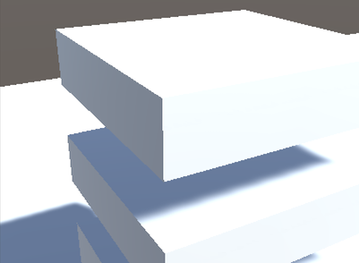
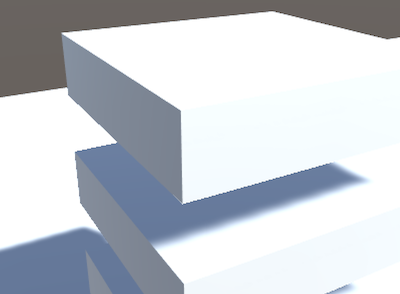

# Unity MSAA shadow fix

## Description

MSAA multisampling is essential to create stable, non-flickering images for VR applications. Shadowmapping however is not working correctly with MSAA, resulting in hard edges where lit objects overlap shadowed areas.

The basic idea of this fix is to apply FXAA to the shadowmask in order to smooth edges. This solution uses a GrabPass in the shader and might not be the most efficient, but it works fine and allows alternative shadows like NGSS.

## Example Pics

No MSAA: 

MSAA - no fix:

 

MSAA - no fix:

## Usage

Add MsaaShadowFix to any directional light. A commandbuffer is added on enable.

## Notes

Great thanks to mattdesl for providing the fxaa shader code here: https://github.com/mattdesl/glsl-fxaa 
 

